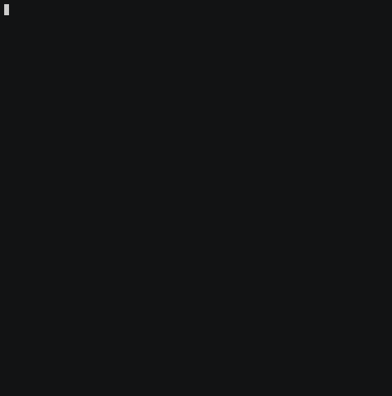

# mcutie
MQTT recon app




## Setup instructions
* Install [mosquitto](https://mosquitto.org/download/)
* Project uses [pipenv](https://docs.pipenv.org/)
```sh
cd mcutie
pipenv install
# other commands on the preview above
```
